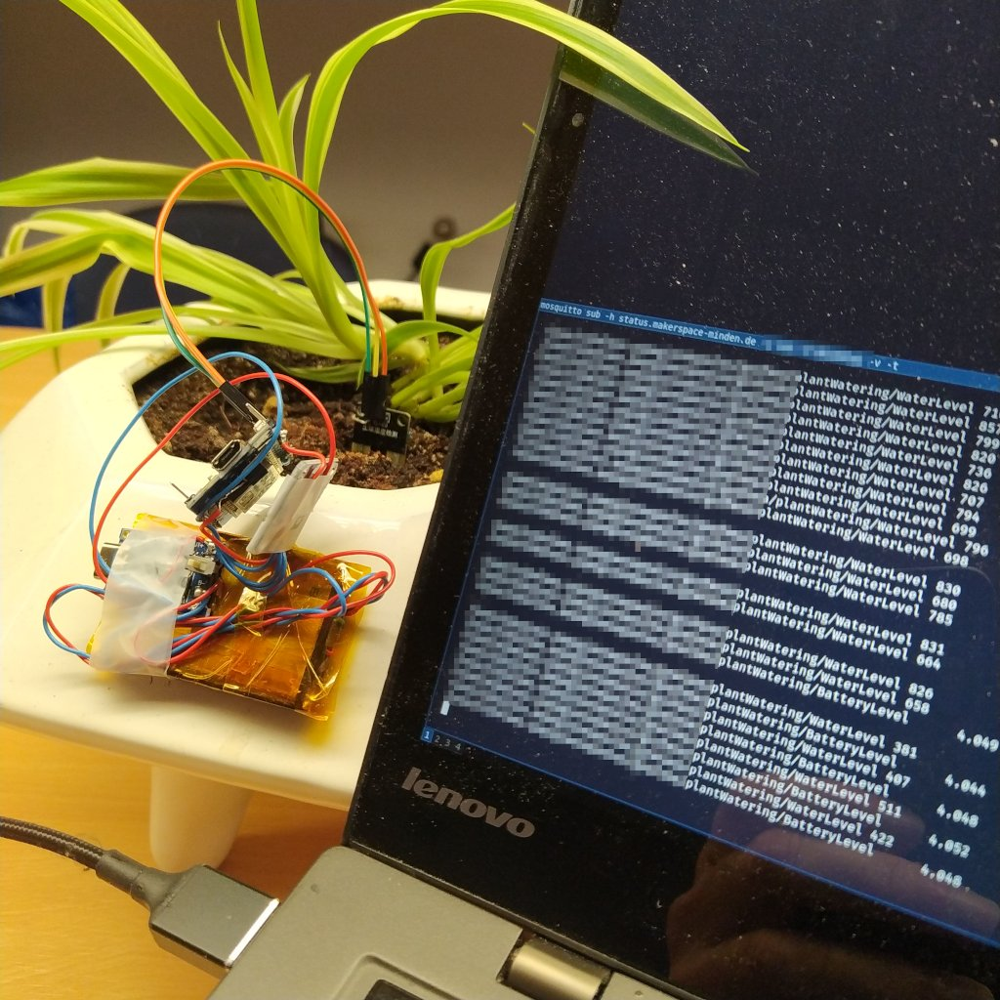

# ESP8266 (Wemos D1 mini) Plant watering / soil moisture measurement

## Configuration

Copy the `/include/config.dist.h` to `/include/config.h` and fill it out with your data.

Copy the `/platformio.dist.ini` to `/platformio.ini` and fill it out with your data.

